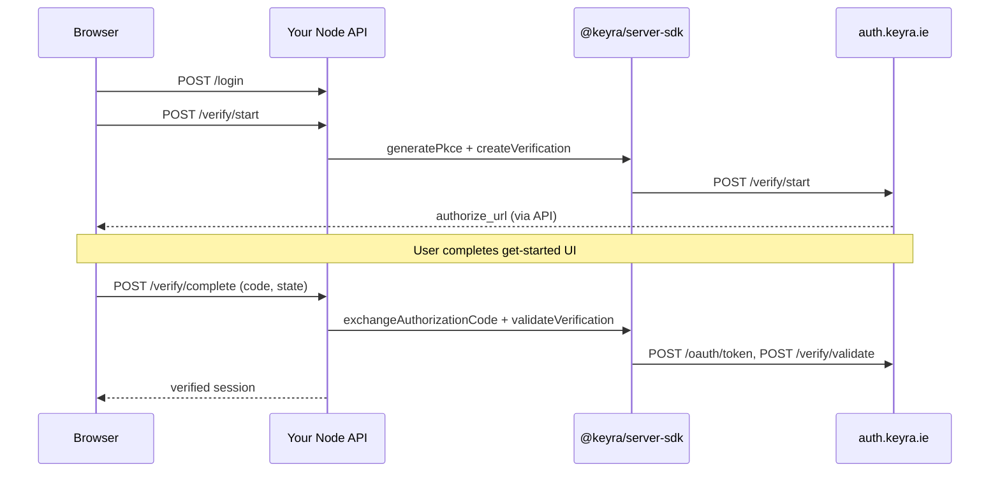

# @keyra/server-sdk

TypeScript **server-side** SDK for the KEYRA **authorize/verify** flow. Use it in Node.js, Express, Fastify, NestJS, or any runtime with `fetch`.

Same backend endpoints as the [Java SDK](../keyra-java-sdk/README.md): `POST /verify/start`, `POST /oauth/token`, `POST /verify/validate`.

---

## When to use this SDK

| Use server SDK | Use `@keyra/web-sdk` instead |
|----------------|------------------------------|
| Your API owns PKCE + sessions | Browser runs OAuth init + token exchange |
| `POST /verify/start` | `POST /oauth/authorize/init` |
| You validate tokens on the server | You only need client-side popup UX |

**Recommended production pattern:** browser → your Node API → `@keyra/server-sdk` → `auth.keyra.ie`.

---

## Architecture



---

## Prerequisites

1. A project on [developer.keyra.ie](https://developer.keyra.ie)
2. **Redirect URI** registered exactly (e.g. `https://yourapp.com/callback`)
3. Auth backend URL (e.g. `https://auth.keyra.ie` or `http://localhost:4000` for local dev)

---

## Credentials (what to enter where)

| Portal name | Env variable | Format | Needed for this SDK? |
|-------------|--------------|--------|----------------------|
| **Publishable client ID** | `KEYRA_PUBLISHABLE_CLIENT_ID` | `cp_test_…` / `cp_live_…` | **Yes** — only credential required |
| **Secret client ID** | — | `cp_test_…` (secret row) | **No** — do not set for `@keyra/server-sdk` verify flow |
| **Secret key** | — | `sk_test_…` / `sk_prod_…` | **No** — server-only; never in Node env for this flow |

`createKeyraServer()` has **no** `apiKey` or secret fields. Every verify-flow call uses the **publishable** id as `client_id`:

| Method | `client_id` value |
|--------|-------------------|
| `createVerification` | Publishable client ID |
| `exchangeAuthorizationCode` | Publishable client ID (same as start) |
| `validateVerification` | Publishable client ID |

### Env file (minimum)

```bash
KEYRA_AUTH_BACKEND_URL=https://auth.keyra.ie
KEYRA_PUBLISHABLE_CLIENT_ID=cp_test_xxxxxxxx   # publishable only
KEYRA_VERIFY_REDIRECT_URI=https://yourapp.com/callback
```

### What not to do

- Do **not** put the secret client ID or `sk_*` secret key in `KEYRA_PUBLISHABLE_CLIENT_ID`.
- Do **not** use the secret client ID on `POST /oauth/token` — you will get `invalid_grant`.

If you also run Java services, those may need the secret pair for `KeyraClient.builder()` — keep that in **Java env only**, not in the browser or this Node SDK config.

---

## Install

```bash
npm install @keyra/server-sdk
# or from git
npm install git+https://github.com/Ciright-Inc/keyra-server-sdk.git
```

Local development:

```json
{
  "dependencies": {
    "@keyra/server-sdk": "file:../keyra-server-sdk"
  }
}
```

Build the package:

```bash
npm run build
```

---

## Quick start

```ts
import { createKeyraServer, generatePkce } from "@keyra/server-sdk";

const keyra = createKeyraServer({
  baseUrl: process.env.KEYRA_AUTH_BACKEND_URL!,
});

const publishableClientId = process.env.KEYRA_PUBLISHABLE_CLIENT_ID!;
const redirectUri = process.env.KEYRA_VERIFY_REDIRECT_URI!;

// 1) Start (store state + codeVerifier in session)
const pkce = generatePkce();
const state = crypto.randomUUID();

const start = await keyra.createVerification({
  client_id: publishableClientId,
  redirect_uri: redirectUri,
  state,
  code_challenge: pkce.codeChallenge,
  code_challenge_method: "S256",
  mode: "popup",
  scope: "openid profile phone",
});

// Return start.authorize_url to the browser

// 2) Complete (after callback with code + state)
const tokens = await keyra.exchangeAuthorizationCode({
  code,
  code_verifier: pkce.codeVerifier,
  redirect_uri: redirectUri,
  client_id: publishableClientId,
});

const validation = await keyra.validateVerification({
  verification_token: tokens.access_token,
  client_id: publishableClientId,
});

if (!validation.valid) throw new Error("Verification failed");
```

---

## Implementation guide

### Step 0 — App login

Implement your own login (email/password, SSO, etc.). KEYRA runs as step-up verification afterward.

### Step 1 — `POST /verify/start` (your route)

1. Ensure user is logged in (your session).
2. `const pkce = generatePkce()`
3. `const state = crypto.randomUUID()`
4. Call `keyra.createVerification({ ... })`
5. Save in session: `state`, `pkce.codeVerifier`, `redirect_uri`
6. Respond with `{ authorizeUrl, state }`

### Step 2 — Browser opens authorize UI

Open `authorizeUrl` in a popup or redirect. The get-started UI posts `KEYRA_AUTH_SUCCESS` with `{ code, state }` or redirects to your callback URL.

### Step 3 — `POST /verify/complete` (your route)

1. Require login session.
2. Compare `body.state` with session state.
3. `exchangeAuthorizationCode` with stored verifier.
4. Optionally `getOAuthUserInfo(accessToken)` if token response has no `user`.
5. `validateVerification` with `verification_token: access_token`.
6. Store verified flag + user in session; return success.

### Step 4 — Home / protected APIs

Check session `verified` before sensitive operations.

---

## API reference

| Export | HTTP | Description |
|--------|------|-------------|
| `createKeyraServer({ baseUrl, timeoutMs? })` | — | Factory |
| `generatePkce()` | — | `{ codeVerifier, codeChallenge, codeChallengeMethod }` |
| `createVerification(input)` | `POST /verify/start` | Returns `authorize_url`, `verification_id`, … |
| `exchangeAuthorizationCode(input)` | `POST /oauth/token` | PKCE code exchange |
| `getOAuthUserInfo(accessToken)` | `GET /oauth/userinfo` | User claims fallback |
| `validateVerification(input)` | `POST /verify/validate` | Server trust boundary |
| `KeyraServerError` | — | `status`, `body` on API errors |

### Types (main fields)

```ts
CreateVerificationInput = {
  client_id: string;
  redirect_uri: string;
  state: string;
  code_challenge: string;
  code_challenge_method: "S256";
  mode?: "auto" | "popup" | "redirect";
  scope?: string;
};

ExchangeAuthorizationCodeInput = {
  code: string;
  code_verifier: string;
  redirect_uri: string;
  client_id: string; // publishable cp_*
};

ValidateVerificationInput = {
  verification_token: string;
  client_id?: string;
};
```

---

## Environment variables (demo / production)

| Variable | Credential type | Purpose |
|----------|-----------------|---------|
| `KEYRA_AUTH_BACKEND_URL` | — | Auth API base |
| `KEYRA_PUBLISHABLE_CLIENT_ID` | **Publishable client ID** | All verify + OAuth `client_id` fields |
| `KEYRA_VERIFY_REDIRECT_URI` | — | Must match portal exactly |
| `SESSION_SECRET` | — | Your app session cookie (demo only) |

**Not used:** secret client ID, secret key (`sk_*`).

---

## Demo application

**`examples/local-test-app`** — Express + vanilla frontend, **no** `@keyra/web-sdk`:

```bash
npm run build          # from repo root
cd examples/local-test-app
cp .env.example .env
npm install
npm start              # http://localhost:8082
```

Register `http://localhost:8082/callback` in the developer portal.

| Demo route | SDK calls |
|------------|-----------|
| `POST /api/verify/start` | `generatePkce`, `createVerification` |
| `POST /api/verify/complete` | `exchangeAuthorizationCode`, `getOAuthUserInfo`, `validateVerification` |

Details: [examples/local-test-app/README.md](examples/local-test-app/README.md)

---

## Error handling

```ts
import { KeyraServerError } from "@keyra/server-sdk";

try {
  await keyra.exchangeAuthorizationCode({ ... });
} catch (err) {
  if (err instanceof KeyraServerError) {
    console.error(err.status, err.body); // OAuth error payload
  }
}
```

---

## Security checklist

- Keep PKCE `codeVerifier` in server session only.
- Use publishable `cp_*` for token exchange (not secret client id).
- Always `validateVerification` before upgrading trust.
- Do not ship `sk_*` to the browser.

---

## Troubleshooting

| Error | Fix |
|-------|-----|
| `invalid_redirect_uri` | Add exact callback URL in developer portal |
| `invalid_grant` | Use same publishable `client_id` as `createVerification` |
| `invalid_state` | Persist and compare state server-side |
| `verification_not_started` | Session expired between start and complete |

---

## Related SDKs

- [keyra-java-sdk](../keyra-java-sdk/README.md) — JVM equivalent
- [@keyra/web-sdk](../keyra-web-sdk/README.md) — browser `/oauth/authorize/init` flow

## License

MIT
