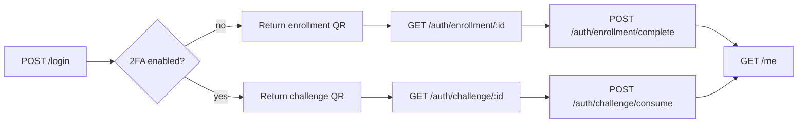

# KEYRA Partner 2FA — Email + Password Login Example

Runnable demo: **your app** handles email/password login; **KEYRA** handles enrollment and step-up approval (QR + phone OTP on get-started).

| Service | URL |
|---------|-----|
| **API** (Express) | http://localhost:3001 |
| **UI** (Vite) | http://localhost:5173 (proxies `/login`, `/auth/*`, `/me`) |
| **Auth backend** | `KEYRA_BASE_URL` (e.g. http://localhost:4000) |
| **get-started** (QR targets) | Set via auth `KEYRA_ENROLL_BASE_URL` / `KEYRA_CHALLENGE_BASE_URL` |

## Prerequisites

1. Secret API key from [developer.keyra.ie](https://developer.keyra.ie) (`clientId` + `clientSecret`, project-scoped).
2. Auth backend with Partner 2FA enabled (`IDENTITY_2FA_ENABLED=true`).
3. Built SDK at repo root: from `keyra-server-sdk/`, run `npm run build`.
4. **Both** processes for this example:
   - `npm run dev` here (API **3001** + UI **5173**)
   - Auth session on port **4000**

## Setup

```bash
cd examples/partner-email-login
cp .env.example .env
# Fill KEYRA_PROJECT_ID, KEYRA_CLIENT_ID, KEYRA_CLIENT_SECRET, KEYRA_BASE_URL
npm install
npm run dev
```

Open http://localhost:5173

**Seed user:** `demo@example.com` / `password`

Verify API: `curl http://localhost:3001/health` → `"keyraConfigured":true`

## Quick flow (what to copy into your app)



1. **Login** — validate your credentials; call `keyra.get2FAStatus(userId)`.
2. **Not enrolled** — `enable2FA` → show `qrCode` → poll until `terminal === 'COMPLETED'` → your session.
3. **Enrolled** — `startAuthentication` → show `qrCode` → poll until `status === 'approved'` → `consumeChallenge` → your session.

SDK details: [keyra-server-sdk README — Partner 2FA](../../README.md#partner-2fa-your-login--keyra-step-up)

## Enrollment flow (SDK + this demo)

| Phase | Component | What happens |
|-------|-----------|----------------|
| Start | `keyra.enable2FA(userId)` | Partner `POST /v1/identities/enroll` → `enrollmentId`, `qrCode` |
| Display | React | Renders `qrImageDataUrl` / opens `qrCode` URL |
| User | get-started | `/enroll/:token?exp=&sig=` → phone → OTP |
| Poll | `GET /auth/enrollment/:id` | Proxies `keyra.pollEnrollment` |
| Done | `POST /auth/enrollment/complete` | When `terminal === 'COMPLETED'` or `status === 'completed'` |

SDK reference: [Enrollment flow](../../README.md#enrollment-flow-first-time-setup)

## User journeys

### First login (not enrolled)

1. Sign in with email/password.
2. App shows **Enable KEYRA 2FA** + QR.
3. Scan QR → complete phone OTP on get-started (same host as in `KEYRA_ENROLL_BASE_URL`).
4. get-started sets **`simsecure_session`** on the auth domain after OTP.
5. Browser polls enrollment until `terminal === 'COMPLETED'`.
6. App creates **demo session** → **Home**.

### Return login (enrolled, KEYRA session active)

1. Sign in with email/password.
2. App shows **Verify sign-in** + QR.
3. Scan QR on a browser that still has `simsecure_session` for the **same phone** and **same host** as enroll.
4. get-started shows **Approve / Decline** (no OTP).
5. Poll until `status === 'approved'` → `consumeChallenge` → **Home**.

### Return login (no KEYRA session)

Same as above, but get-started prompts for **OTP** first, then approve. Challenge OTP also refreshes the KEYRA session for next time.

## API routes (this demo)

| Method | Path | Purpose |
|--------|------|---------|
| POST | `/login` | Credentials + KEYRA status → setup or challenge |
| GET | `/auth/enrollment/:id` | Poll enrollment |
| POST | `/auth/enrollment/complete` | Finish setup + demo session |
| GET | `/auth/challenge/:id` | Poll challenge |
| POST | `/auth/challenge/consume` | One-time token + demo session |
| GET | `/me` | Current user |
| GET | `/health` | `keyraConfigured` flag |

Never expose `KEYRA_CLIENT_SECRET` to the browser.

## Environment

```bash
KEYRA_BASE_URL=http://localhost:4000
KEYRA_PROJECT_ID=
KEYRA_CLIENT_ID=
KEYRA_CLIENT_SECRET=
```

Auth backend (operator):

```bash
KEYRA_ENROLL_BASE_URL=http://192.168.0.152:5174   # LAN IP for phone QR
KEYRA_CHALLENGE_BASE_URL=http://192.168.0.152:5174
```

Use one hostname consistently (`localhost` vs `192.168.x.x` do not share cookies).

## Manual test checklist

- [ ] `.env` configured; `GET http://localhost:3001/health` → `keyraConfigured: true`
- [ ] `npm run dev` starts **both** port 3001 and 5173
- [ ] First login: enrollment QR → phone OTP → Home; DevTools shows `simsecure_session` on auth origin after enroll
- [ ] Second login (same browser): challenge → **Approve** without OTP → Home
- [ ] Incognito: challenge requires OTP
- [ ] Decline challenge on phone → UI shows error
- [ ] Wrong password → 401

## Notes

- `qrCode` on SDK responses is the **URL string** to encode. This demo also returns `qrImageDataUrl` from the server.
- Enrollment poll: `result.terminal === 'COMPLETED'` (or `status === 'completed'`).
- Challenge poll: `result.status === 'approved'` and `verificationToken` present before `consumeChallenge`.
- Partner 2FA is separate from authorize/verify (`createKeyraServer`); do not mix publishable-only credentials here.
